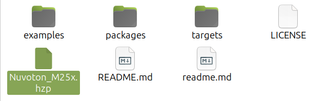
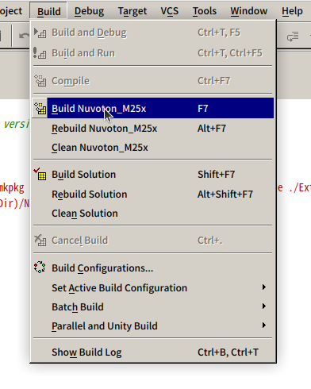
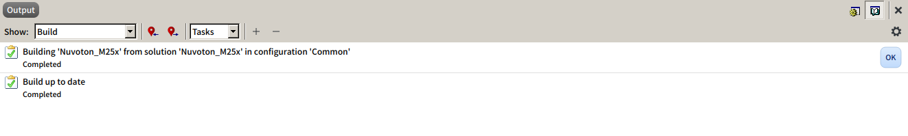
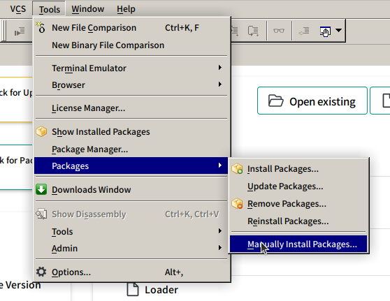
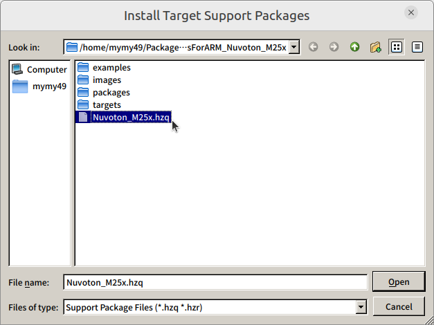
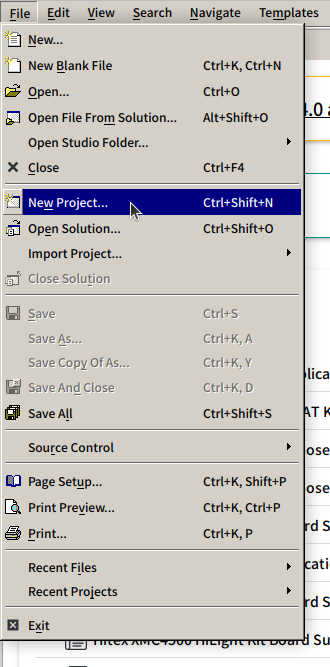
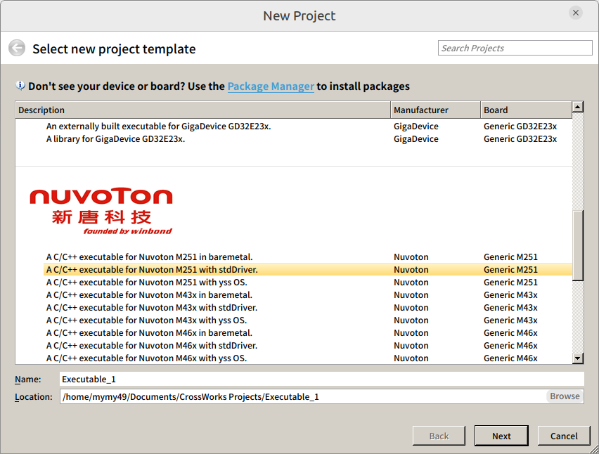
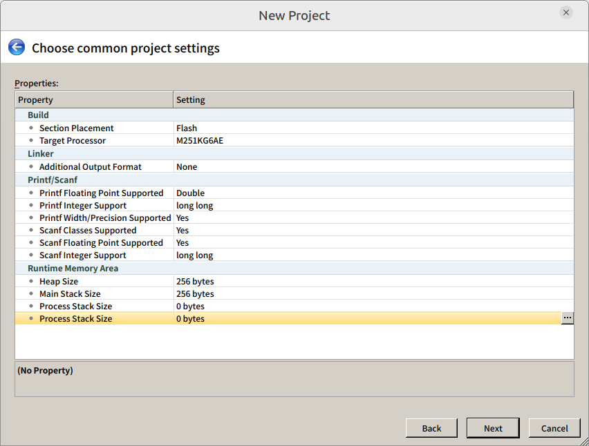
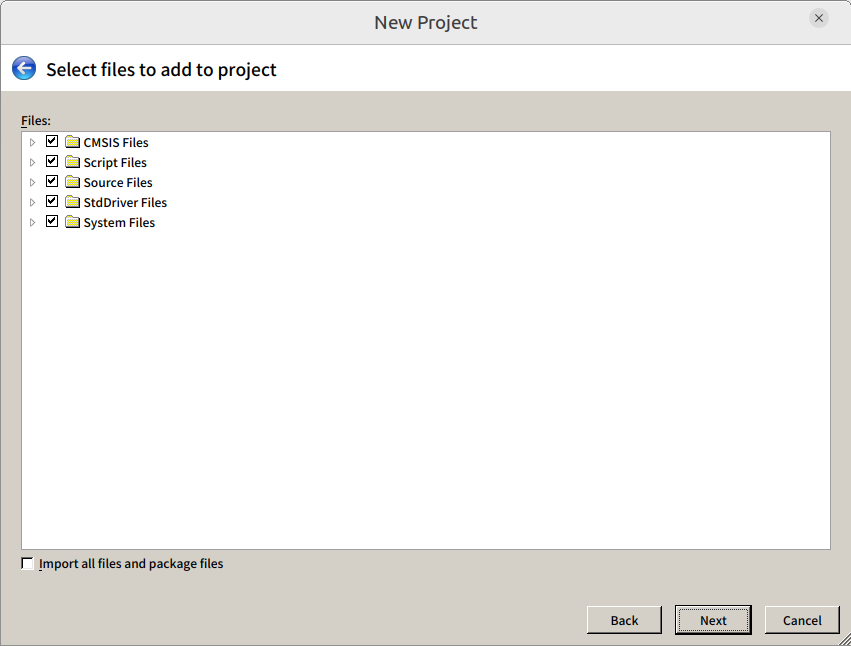
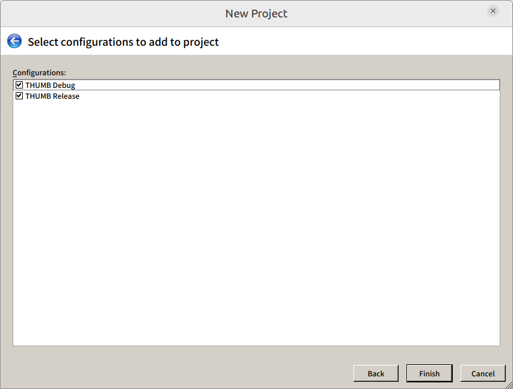

# CrossworksForARM_Nuvoton_M251

## 본 프로젝트는

본 프로젝트는 Crossworks for ARM IDE에서 Nuvoton M251 시리즈를 지원하기 위해 만들어졌습니다. baremetal, stdDriver, yss OS 세 가지 환경으로 프로젝트 생성이 가능하도록 했습니다.

---

## Crossworks for ARM IDE는?

gcc 컴파일러를 기반으로 구성된 IDE입니다. 편리한 소스코드 에디팅과 많은 ARM 코어 계열의 MCU와 MPU를 지원하고 있습니다. C/C++을 지원합니다. Host PC의 운영체제로 Linux, Windows, MAC 환경을 지원합니다. 펌웨어 디버깅에 최적화된 화면 구성과 빠른 디버깅 동작 속도를 보여주고 있습니다. 
유료 제품으로 라이센스 구매는 [Rowley Associates Ltd.](https://www.rowley.co.uk/arm/index.htm)에서 가능합니다.

---

## 패키지 빌드 및 설치

### 패키지 빌드

*.hzp 파일을 더블 클릭 프로그램을 실행합니다.

실행된 Crossworks for ARM의 메뉴 중에 **Build -> Build Project_Name**를 클릭하여 빌드를 합니다. 또는 F7 단축키를 사용도 가능합니다.

정상적으로 빌드가 완료되면 아래와 같이 Output 탭에 결과가 출력됩니다.

### 패키지 설치

메뉴 **Tools -> Packages -> Manually Install Packages**를 클릭합니다.

아래 이미지와 같이 나타난 창과 같이 프로젝트 폴더로 이동하여  생성된 hzq 파일을 선택합니다.

---

## 타겟 프로젝트 생성

메뉴 **File -> New Project**를 선택합니다.

**A C/C++ executable for Nuvoton M251 with stdDriver.** 항목을 선택하고, 경로와 프로젝트 이름을 설정합니다.

프로젝트에 대한 옵션을 설정합니다. 세부 구성은 프로젝트 옵션에서 변경 가능합니다.

프로젝트에 포함시킬 파일을 선택합니다. 기본적으로는 구성된 파일이 모두 선택되어 있습니다.

끝으로 빌드 구성을 선택합니다. 

**THUMB Debug**는 최적화 레벨은 없음이고 디버깅 레벨은 Level3 입니다.
모든 디버깅 정보를 갖고 있어, 디버깅에 최적화 되어 있습니다. 

**THUMB Release**는 최적화  레벨은 Level1이고 디버깅 레벨은 없음 입니다. 

세부 구성은 옵션에서 변경이 가능합니다. 아래 두 구성 개발 진행간에 스위칭이 가능합니다. 

---

[이 프로젝트는 Markus Klein님의 도움을 받아 제작되었습니다.](https://github.com/Masmiseim36/Kinetis)
